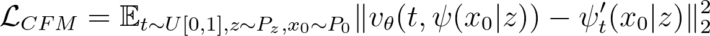

# Latent Flow Matching for MNIST

This repository provides a minimal example for training a flow matching model in a pretrained VAE's latent space to generate MNIST digits. 

## Approach

### Training

Denote the data distribution as $P_1$, we first use a VAE encoder $E(x)$ to transform it into the latent distribution $P_z = E_\ast P_1$, where $\ast$ is the pushforward operation. We then prescribe a flow path between $z \sim P_z$ and $x_0 \sim P_0 = N(0,I)$, then regress on its velocity field $v_\theta(t,x)$ with the conditional flow matching (CFM) loss:
<br/><br/>

<!-- $$\mathbb{E}_{t\sim U[0,1], x_0 \sim P_0, z \sim P_z} \lVert v_\theta(t, \psi(x_0|z)) - \psi_t'(x_0|z) \rVert^2_2$$ -->





Here, $\psi_t(x_0|x_1)$ is the flow map associated with the prescribed flow. We pick it to be $\psi_t(x|y) = (1-(1-\sigma_{min})t)x + ty$. 


### Generation

We sample $z_0 \sim P_0$, integrate it through the learned flow $z_1 = z_0 + \int_0^1 v_\theta(t,z_t)dt$, then decode it with the VAE decoder $x_1 = D(z_1)$ to get the generated image. We parametrize $v_\theta(t,x)$ with a transformer and use a pretrained VAE for $E(x), D(x)$. 


## Results


### VAE Reconstruction

As a sanity check, we can visualize the original and reconstructed digits to ensure the pretrained VAE can embed the images as intended.

| Original  | Reconstructed |
| ------------- | ------------- |
|   |  |

### Generated Digits

| Epoch 1  | Epoch 50 | Epoch 100 |
| ------------- | ------------- | ------------- | 
|   |  |   |

| Epoch 200  | Epoch 300 | Final |
| ------------- | ------------- | ------------- | 
|   |  |   | 


## Dependencies

The code is tested to work on PyTorch 1.13 and CUDA 11.7. The other packages can be installed with 

```
pip install -r requirements.txt
```

## Experiments

Run:

```
python main.py
```

## Attribution

The transformer code is adapted from the DiT official repository: https://github.com/facebookresearch/DiT

The flow matching model is adapted from https://github.com/gle-bellier/flow-matching/tree/main